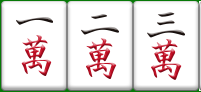

# 麻雀に関するツール群（ご注文は麻雀ですか？）

## はじめに

私は麻雀というゲームが好きで、やっているうちにふと麻雀とプログラミングとの間に関連性を見出すようになりそこからこのようなツール群を開発してみようという流れになりました。

## 麻雀について

### 概要

中国から伝来した室内遊戯の一つであり、基本的に4人で牌（パイ）というものを用いて遊ぶゲームです。とても簡潔に言うと「絵合わせゲーム」とも解釈できるかもしれません。
トランプのポーカーを思い浮かべていただくとイメージが沸くかもしれませんが、このゲームに関しても何かしらの役を作るという事が目標になります。
最初にアガリ（役を完成させた人）が役に応じた点数（厳密に言うと役以外も点数に影響する場合があるがここでは省略）をもらえ、ゲーム終了時に点数が多い人の順から一位（トップ）、低い人が四位（ラス）といった具合のルールになっております。

### あがるには（手牌について）

麻雀は14枚の牌を揃えて完成系（アガリ）を作るというゲームです。
まず、麻雀にはアガリの型について以下のような決まりがあります。
（例外を除く基本的な型）

**3枚 × 4 + 同じ牌2枚**

以下の画像が完成系の型の例になります。

そして、この3枚という部分の作り方は以下の2通りが存在します。

**順子（シュンツ）**

以下が一例です

 　　　　

（注意）123や234といった並びのものは認められますが、891のようなものは認められません。

**刻子（コーツ）**

以下が一例です

 　　　　

字牌で順子を作ることはできないので例外を除き刻子を作る目的として利用されることになります。

そして、残りの同じ牌2枚に関しては **雀頭（じゃんとう）** と呼びます。
しばしば、頭（アタマ）や枕（まくら）とも呼ばれることがあります。

### 役の完成

そして、現代の日本の麻雀ではあがるためには完成した手牌に何かしらの **役（やく）** というものが含まれていなければならないという決まりがあります。
国士無双（こくしむそう）、断么九（タンヤオ）　辺りは聞いたことがある方もおられるのではないでしょうか。そのようなものが役というものになります。

役については種類が多く説明が難しいので以下のサイトなどを参考にしていただけると良いかと思います。

**麻雀の役 一覧表 シンプル見やすい！ | 麻雀豆腐**

<https://majandofu.com/mahjong-hands-simple>

その他色々なルールがあり難しいな複雑だなと感じる部分がおありかとは思いますが、そのような要素があってこそプログラミングに組み込むやりがいというものがあったりする物だったりするので私は個人的には面白いんじゃないかいいじゃないかと捉えております！

# ツールについて

現時点ではこのソースコード内に以下のツールが存在しております。

## 点数計算ツール

任意の手牌をユーザが入力して、そこから役の判定や点数計算を行えるといったものになっております。
「mahjong_keisan/keisan.html」を開くことで起動します。

## 待ち当てツール

手牌が自動生成される仕組みになっており（おもに清一色という役に該当するものが生成される）それの待ちをユーザが考えて当てる練習ができるものとなっております。
「mahjong_machiate/machiate.html」を開くことで起動します。

## 手牌生成ツール

こちらは現在開発中のものになります。指定した役から特定の手牌を生成するといったことができるようにしたいなと考えております。
「mahjong_tehaimaker/tehaimaker.html」を開くことで起動します。